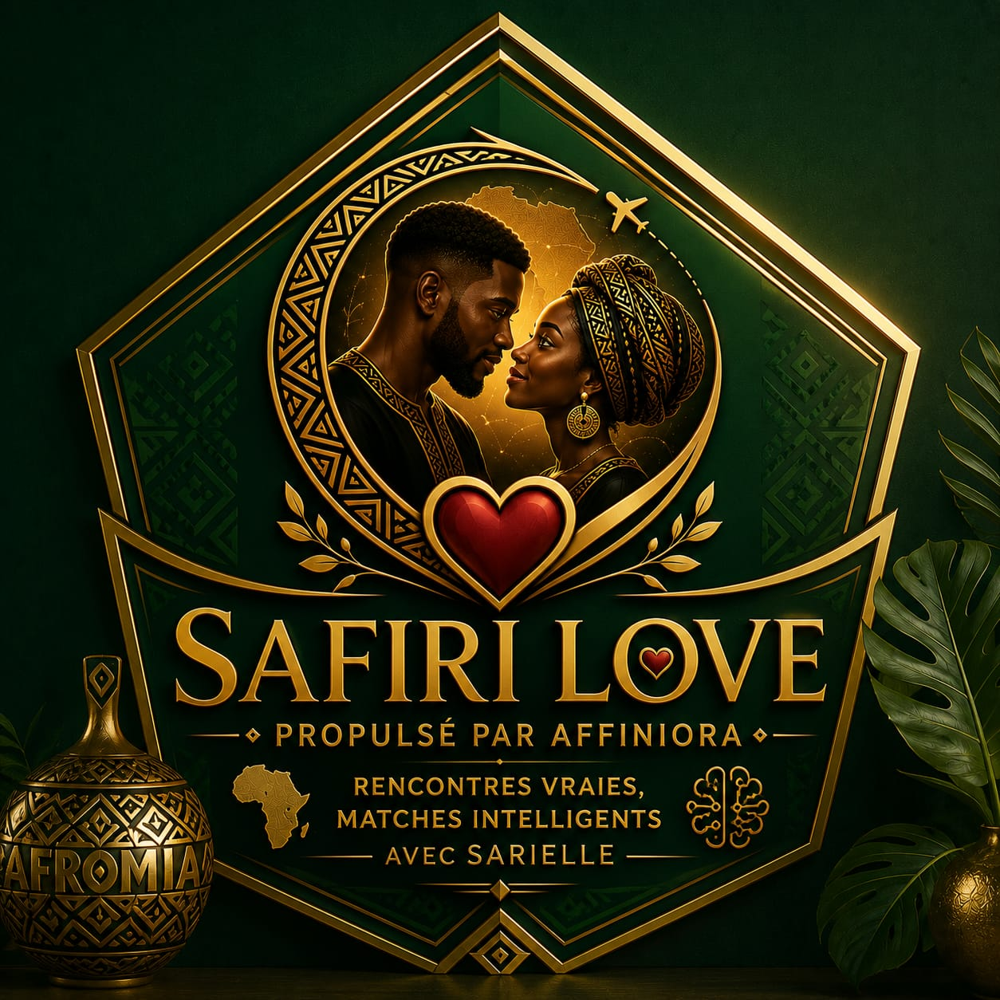

# AFROMIA — Charte de fondation

**Version** : 1.0 · **Juillet 2026**  
**Source** : [Charte_Fondation_AFROMIA.pdf](./Charte_Fondation_AFROMIA.pdf) (Founder Book)  
**Promoteur** : Bruce SIANI

**Documents liés** : [VISION](./VISION.md) · [ARCHITECTURE](./ARCHITECTURE.md) · [Design system](./ux/design.md) · [Modules](./modules/README.md)

---

## Identité visuelle

| Marque | Fichier source (SAFIRI) | Usage |
|--------|-------------------------|-------|
| **AFROMIA** | `SAFIRI/apps/frontend/public/brand/afromia_logo.png` | Société, infrastructure, docs |
| **SAFIRI** | `SAFIRI/apps/frontend/public/brand/logo.jpeg` | Produit utilisateur (app Connect) |

Assets documentation : [`docs/assets/brand/`](./assets/brand/)

<p align="center">
  
  &nbsp;&nbsp;
  
</p>

---

## Vision

> *« Construire l'infrastructure numérique qui permettra à chaque Africain de se connecter, créer, apprendre, entreprendre, commercer, investir et prospérer, grâce à des technologies conçues par l'Afrique et pour l'Afrique. »*

La prochaine révolution africaine sera **numérique**. AFROMIA ne crée pas simplement des applications — elle construit les **fondations technologiques** de la prochaine génération d'entreprises africaines.

**Devise** : *Construire aujourd'hui le numérique de l'Afrique de demain.*

---

## Mission

Créer un **écosystème numérique intégré** qui simplifie la vie des particuliers, des entrepreneurs, des entreprises et des institutions africaines grâce à des solutions innovantes, accessibles et interconnectées.

---

## Les personnalités de l'écosystème

Chaque nom porte une identité claire, une mission précise et une place cohérente dans l'architecture globale.

| Entité | Rôle | Mission |
|--------|------|---------|
| **AFROMIA** | Vision & infrastructure | Société éditrice, plateforme d'infrastructure numérique panafricaine, identité unique, gouvernance |
| **SAFIRI Connect** | Connexion & opportunités | Porte d'entrée de l'écosystème — relier personnes, communautés, événements et opportunités (l'amour n'est qu'un cas d'usage) |
| **AFFINIORA** | Intelligence & raisonnement | Moteur cognitif — affinités, recommandations, personnalisation, agents, orchestration (le cerveau, pas le visage) |
| **Sarielle** | Accompagnement humain | Compagnon numérique personnel de chaque utilisateur — coach vie/relationnel/pro, mémoire de vie (avec consentement), point d'entrée conversationnel vers tout l'écosystème |

```
┌─────────────────────────────────────────────────────────────┐
│                     AFROMIA (société)                       │
│          Vision · Infrastructure · Identité · Wallet        │
└──────────────────────────┬──────────────────────────────────┘
                           │
     ┌─────────────────────┼─────────────────────┐
     ▼                     ▼                     ▼
┌─────────────┐    ┌─────────────┐    ┌─────────────────────┐
│   SAFIRI    │    │  AFFINIORA  │    │  Afromia Identity   │
│  Connect    │◄──►│  (cerveau)  │    │  (passeport unique) │
│ porte entrée│    └──────┬──────┘    └─────────────────────┘
└──────┬──────┘           │
       │                  ▼
       │           ┌─────────────┐
       └──────────►│  Sarielle   │  ← présence quotidienne d'Affiniora
                   │  (visage)   │     (gratuite pour chaque utilisateur)
                   └─────────────┘
```

---

## Gouvernance & équipe

| Rôle | Responsable | Périmètre |
|------|-------------|-----------|
| **Promoteur & fondateur** | Bruce SIANI | Vision stratégique, Founder Book, priorisation produit, validation recette, branding |
| **Lead Dev** | Équipe technique | Architecture, implémentation SAFIRI/AFFINIORA, tests, déploiement AWS, documentation technique |

> **Le Promoteur décide quoi et pourquoi. Le Lead Dev décide comment. Les deux valident le résultat.**

**Règle fondateur** : chaque utilisateur d'AFROMIA dispose **gratuitement** d'une Sarielle personnelle.

---

## Les 7 piliers produit

AFROMIA ne développe que des produits rattachés à ces piliers :

| # | Pilier | Produit phare (MVP / futur) |
|---|--------|----------------------------|
| 1 | **Connecter** | SAFIRI Connect |
| 2 | **Entreprendre** | Afromia Business, Store, CRM… |
| 3 | **Apprendre** | Afromia Learn, Academy, Skills |
| 4 | **Financer** | Afromia Pay, Wallet, Invest |
| 5 | **Créer** | Afromia Creator, Music, Video |
| 6 | **Construire** | Afromia Cloud, API, Identity, Developer |
| 7 | **Intelligence** | AFFINIORA |

---

## Architecture stratégique (couches)

| Niveau | Contenu |
|--------|---------|
| **0 — Fondations** | Afromia Identity (SSO) · AFFINIORA · Afromia Wallet |
| **1 — Produit phare** | SAFIRI Connect |
| **2 — Modules Safiri** | Meet, Events, Communities, Marketplace, Business Pages, Creators |
| **3 — Produits indépendants** | Jenga, Kazi, Elimu, Mali, Biashara, Afya… |
| **4 — Plateforme tech** | Hifadhi (cloud), Afromia Developers, Data Platform |

**Règle des 4C** (conception produit) : chaque produit contribue à au moins deux objectifs parmi **Connect · Create · Collaborate · Commercialize**.

---

## Technologies fondatrices

Patrimoine technologique réutilisé dans tout l'écosystème :

1. **African Opportunity Graph (AOG)** — graphe des relations et opportunités
2. **Affiniora Engine** — moteur cognitif et orchestration
3. **Sarielle** — compagnon conversationnel et coach
4. **Adaptive Experience Engine (AEE)** — interface adaptée au contexte
5. **Living Interface System (LIS)** — composition UI dynamique
6. **Trust Engine** — réputation, badges, ATI (Afromia Trust Index)
7. **Opportunity Engine** — classement des opportunités (pas du contenu social)
8. **Universal Identity** — une identité pour tout l'écosystème
9. **Universal Wallet** — un portefeuille pour tout l'écosystème
10. **Universal Conversation** — conversations persistantes à travers les contextes

---

## Décisions irréversibles

1. **Une seule identité** pour tout l'écosystème.
2. **Une seule couche d'intelligence** : AFFINIORA.
3. Communication inter-produits **exclusivement par API versionnées**.
4. Les **données appartiennent à l'utilisateur** ; consentement explicite requis.
5. Chaque nouveau produit **enrichit l'écosystème sans le fragmenter**.
6. La valeur d'AFROMIA provient des **interactions entre produits**, pas seulement des produits isolés.

---

## Principes fondateurs (sélection)

1. **Résoudre avant d'innover** — pas de feature sans problème identifié.
2. **L'utilisateur avant la technologie** — la complexité reste invisible.
3. **Une seule identité** — SSO et réputation unifiés.
4. **L'IA au service de l'humain** — AFFINIORA transparente, Sarielle bienveillante.
5. **Souveraineté des données** — IA self-hosted au MVP, données africaines pour l'Afrique.
6. **Continuité** — l'utilisateur ne quitte jamais l'écosystème quand il change d'activité.
7. **Product Impact Score** — tout nouveau produit est évalué avant développement.

---

## Positionnement SAFIRI Connect

SAFIRI n'est **ni** un réseau social classique **ni** un simple site de rencontre.

> *La plateforme panafricaine de connexions intelligentes.*

Une seule plateforme pour découvrir les personnes, communautés, événements et opportunités qui correspondent réellement à chacun.

**Énoncé produit** (hérité de la vision initiale) : *« Un écosystème relationnel premium, chaleureux et intelligent — une relation enrichissante. »*

---

## Design & marque

**Philosophie ADS** : *Technology that understands humanity.*

Cinq piliers design : Humanité · Simplicité · Confiance · Adaptabilité · Identité africaine moderne.

Le logo AFROMIA transmet : connexion, croissance, mouvement, intelligence.

**Règle d'or UX** : chaque écran répond à une seule question — *quelle valeur puis-je créer ou obtenir maintenant ?*

Référence détaillée : [docs/ux/design.md](./ux/design.md)

---

## Workflow documentaire

| Action | Document de référence |
|--------|----------------------|
| Onboarding contributeur | [README](./README.md) → charte → module concerné |
| Nouvelle feature | [SPEC](./SPECIFICATION_FONCTIONNELLE.md) + fiche module + Product Impact Score |
| Décision architecture | Cette charte (décisions irréversibles) + [ARCHITECTURE](./ARCHITECTURE.md) |
| Déploiement | [infra/README](./infra/README.md) · [DEVOPS_PIPELINE](./infra/DEVOPS_PIPELINE.md) |
| Recette | [RECETTE](./RECETTE.md) — validation par le Promoteur |
| État technique | [ETAT_AVANCEMENT](./ETAT_AVANCEMENT.md) |

---

*Cette page synthétise le Founder Book v1.0. Pour le détail intégral (PRD, architecture technique, roadmap produits, business), consulter le PDF source.*
