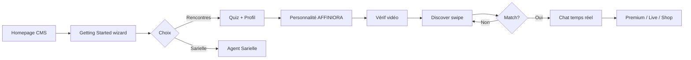

# AFROMIA / SAFIRI — Spécification fonctionnelle MVP v1

**Version** : 2.0  
**Date** : 22 juin 2026  
**Référence vision** : [VISION.md](./VISION.md)  
**État réel** : [ETAT_AVANCEMENT.md](./ETAT_AVANCEMENT.md)  
**Recette** : [RECETTE.md](./RECETTE.md)  
**Fiches modules** : [modules/README.md](./modules/README.md)

---

## Table des matières

1. [Objet et périmètre](#1-objet-et-périmètre)
2. [Légende et statuts](#2-légende-et-statuts)
3. [Acteurs et rôles](#3-acteurs-et-rôles)
4. [Parcours utilisateur](#4-parcours-utilisateur)
5. [Module 0 — Homepage & CMS multilingue](#module-0--homepage--cms-multilingue)
6. [Module 1 — Authentification & compte](#module-1--authentification--compte)
7. [Module 2 — Profil & onboarding](#module-2--profil--onboarding)
8. [Module 3 — Intelligence AFFINIORA](#module-3--intelligence-affiniora)
9. [Module 3b — Sarielle (agent conversationnel)](#module-3b--sarielle-agent-conversationnel)
10. [Module 4 — Vérification & confiance](#module-4--vérification--confiance)
11. [Module 5 — Discovery & matching](#module-5--discovery--matching)
12. [Module 6 — Messagerie & social](#module-6--messagerie--social)
13. [Module 7 — Premium & monétisation](#module-7--premium--monétisation)
14. [Module 8 — Live streaming](#module-8--live-streaming)
15. [Module 9 — Boutique cadeaux](#module-9--boutique-cadeaux)
16. [Module 10 — Appels vidéo WebRTC](#module-10--appels-vidéo-webrtc)
17. [Module 11 — CMS & blog](#module-11--cms--blog)
18. [Module 12 — Notifications](#module-12--notifications)
19. [Module 13 — Administration & modération](#module-13--administration--modération)
20. [Module 14 — RGPD & conformité](#module-14--rgpd--conformité)
21. [Module 15 — Design & UX](#module-15--design--ux)
22. [Exigences non fonctionnelles](#22-exigences-non-fonctionnelles)
23. [Intégrations externes](#23-intégrations-externes)
24. [Limitations connues & backlog](#24-limitations-connues--backlog)
25. [Critères d'acceptation globaux MVP](#25-critères-dacceptation-globaux-mvp)

---

## 1. Objet et périmètre

Ce document décrit **toutes les fonctionnalités du MVP v1** de l'écosystème AFROMIA :

- **SAFIRI** : application de rencontre (frontend Next.js 15 + backend FastAPI)
- **AFFINIORA** : microservice IA (scoring, personnalité, anti-fake, agent Sarielle)
- **Sarielle** : agent conversationnel intégré à SAFIRI

**Hors périmètre MVP v1** : apps natives iOS/Android, entraînement modèles custom, dashboard AFFINIORA standalone, liveness vidéo ML réel.

> **État d'implémentation** : voir [ETAT_AVANCEMENT.md](./ETAT_AVANCEMENT.md). Ce document décrit le **quoi** ; l'état d'avancement réel est dans le document dédié.

---

## 2. Légende et statuts

| Statut (ETAT_AVANCEMENT) | Signification |
|--------------------------|---------------|
| ✅ Opérationnel | Fonctionne bout-en-bout en local standard |
| 🟡 Partiel | Code présent, config ou UX incomplète |
| 🚧 En cours | Bugs connus, recette active |
| 🔴 Non implémenté | Absent ou non configurable |

Chaque module renvoie à sa fiche : `docs/modules/XX-*.md`

---

## 3. Acteurs et rôles

| Acteur | Rôle RBAC |
|--------|-----------|
| Visiteur | — |
| Utilisateur free | `user` |
| Utilisateur premium | `premium` |
| Modérateur | `moderator` |
| Admin | `admin` |
| Super admin | `super_admin` |

---

## 4. Parcours utilisateur

### 4.1 Parcours principal (cible)



### 4.2 Parcours admin

```
Login admin → Dashboard KPI → Notifications internes
    → Modération signalements → Vérif vidéo
    → CMS homepage → Test AFFINIORA → Messages users
```

---

## Module 0 — Homepage & CMS multilingue

**Fiche** : [modules/01-homepage-cms.md](./modules/01-homepage-cms.md)

| ID | Fonctionnalité | Description |
|----|----------------|-------------|
| CMS-HP-01 | Homepage responsive premium | Design épuré, onglets newsletter/contact |
| CMS-HP-02 | CMS multilingue | Édition blocs par locale, fallback i18n |
| CMS-HP-03 | Hero « relation enrichissante » | Copy éditable ; pas « relation intelligente » |
| CMS-HP-04 | Cards cliquables | Chaque card mène à une page dédiée |
| CMS-HP-05 | Vidéo + galerie | Section médias affirmant la vision produit |
| CMS-HP-06 | Newsletter + contact | Formulaires fonctionnels, enregistrement backend |
| CMS-HP-07 | Galerie admin | Upload fichiers locaux + URLs |
| CMS-HP-08 | Revalidation instantanée | Mise à jour sans redémarrage serveur |
| CMS-HP-09 | Ancres navigation | Liens ancres **uniquement** sur `/` |
| CMS-HP-10 | Sarielle sur homepage | Chatbot langue navigateur, repliable |
| CMS-HP-11 | Naming produit | SAFIRI / AFFINIORA / Sarielle explicites |

**Routes** : `GET /api/v1/cms/homepage`, `POST /api/v1/cms/admin/homepage/*`  
**Pages** : `/`  
**Admin** : onglet Homepage CMS

---

## Module 1 — Authentification & compte

**Fiche** : [modules/02-auth-wizard.md](./modules/02-auth-wizard.md)

| ID | Fonctionnalité | Description |
|----|----------------|-------------|
| AUTH-01 | Inscription email/mot de passe | Hash bcrypt, statut `pending_verification` |
| AUTH-02 | Connexion / déconnexion | JWT access + refresh |
| AUTH-03 | Refresh token | Rotation sessions |
| AUTH-04 | Vérification email | Token purpose ; envoi SMTP (Celery) |
| AUTH-05 | Mot de passe oublié / reset | Token temporaire |
| AUTH-06 | OAuth social | Google, Apple, Microsoft, Facebook, X, TikTok |
| AUTH-07 | Profil session `/auth/me` | User + rôle + premium |
| AUTH-08 | Login-as (dev) | Comptes seed uniquement |
| AUTH-09 | Wizard Getting Started | Auto-save par champ, multilingue, 7 étapes |
| AUTH-10 | Consentement IA | **Désactivé par défaut** ; opt-in entraînement |
| AUTH-11 | Gate email vérifié | **Bloquer Discover** sans email vérifié |
| AUTH-12 | Wizard sans connexion prématurée | Pas de redirect Sarielle avant fin wizard |

**Routes** : `POST /api/v1/auth/register`, `/register-draft`, `/login`, `/refresh`, `/verify-email`, …  
**Pages** : `/login`, `/register`, `/getting-started`, `/verify-email`, `/auth/callback`

---

## Module 2 — Profil & onboarding

**Fiche** : [modules/04-profils-onboarding.md](./modules/04-profils-onboarding.md)

| ID | Fonctionnalité | Description |
|----|----------------|-------------|
| PROF-01 | CRUD profil | Bio, genre, orientation, PostGIS |
| PROF-02 | Intérêts & langues | Tags, filtrage Discover |
| PROF-03 | Photos profil | Presign S3, modération |
| PROF-04 | Vidéos profil | Presign + upload |
| PROF-05 | Complétion profil | Score %, gate features |
| PROF-06 | Visibilité profil | `public` / `matches_only` / privé |
| PROF-07 | Posts profil | Micro-posts 280 car. |
| PROF-08 | Onboarding guidé | Wizard + quiz |
| PROF-09 | Paramètres compte | Thème, langue, préférences |
| PROF-10 | Pages profil visitables | Depuis Discover, Matches, Chat |
| PROF-11 | Personality toutes sections | `/personality` : sections remplies visibles |
| PROF-12 | Médias optionnels wizard | Impact accès services si absents |

**Pages** : `/profile`, `/profile/edit`, `/profile/[userId]`, `/personality`, `/onboarding`

---

## Module 3 — Intelligence AFFINIORA

**Fiche** : [modules/05-affiniora.md](./modules/05-affiniora.md)

### 3.1 Microservice AFFINIORA

| ID | Fonctionnalité | Endpoint |
|----|----------------|----------|
| AI-01 | Score compatibilité **réel** | `POST /v1/score/compatibility` |
| AI-02 | Analyse personnalité | `POST /v1/analyze/personality` |
| AI-03 | Anti-fake profil | `POST /v1/detect/fake-profile` |
| AI-04 | Suggestions conversation | `POST /v1/suggest/conversation` |
| AI-05 | Traduction | `POST /v1/translate` |
| AI-06 | Versioning modèles | `GET/PUT /v1/models/*` |
| AI-07 | Pas de faux scores | Indicateur « IA indisponible » si down (pas fallback 65 % silencieux) |

### 3.2 Intégration SAFIRI ↔ AFFINIORA

| ID | Fonctionnalité | Description |
|----|----------------|-------------|
| INT-01 | Client HTTP Affiniora | `AffinioraClient` |
| INT-02 | Cache Redis | TTL 24h |
| INT-03 | Quiz → Celery → personnalité | `analyze_personality_task` |
| INT-04 | Match → score persisté | Celery |
| INT-05 | Discover scores | Breakdown sur cartes |
| INT-06 | Suggestions chat | Bouton composer |
| INT-07 | Onglet Affiniora Discover | Hub flottant modale |

**Prérequis** : AFFINIORA `:8001`, Celery worker, `AFFINIORA_API_URL`

---

## Module 3b — Sarielle (agent conversationnel)

**Fiche** : [modules/03-sarielle.md](./modules/03-sarielle.md)

| ID | Fonctionnalité | Description |
|----|----------------|-------------|
| SAR-01 | Page `/sarielle` | Style prompt, choix modèle |
| SAR-02 | Navigation assistée | Liens directs, redirections pages |
| SAR-03 | Hub flottant | Repliable, homepage + pages info |
| SAR-04 | Multilingue | Langue navigateur / préférences |
| SAR-05 | Choix wizard | Rencontres directes ou Sarielle |
| SAR-06 | Retour utilisateur | « Commencer » → Sarielle si compte existant |
| SAR-07 | Jobs async | Polling, timeout, feedback |
| SAR-08 | Consentement IA requis | Accompagnement si opt-in uniquement |

**Routes** : `POST /api/v1/chat/sarielle/*`  
**AFFINIORA** : `agents/sarielle.py`

---

## Module 4 — Vérification & confiance

**Fiche** : [modules/06-verification-confiance.md](./modules/06-verification-confiance.md)

| ID | Fonctionnalité | Description |
|----|----------------|-------------|
| TRUST-01 | Vérification vidéo selfie | 10–30 s, upload S3 |
| TRUST-02 | Traitement async | Celery + anti-fake (pas liveness ML) |
| TRUST-03 | Gate Discover `is_verified` | Configurable |
| TRUST-04 | Statut vérif | `GET /verification/status` |
| TRUST-05 | Blocage utilisateur | `POST/DELETE /users/{id}/block` |
| TRUST-06 | Signalement | → modération admin |
| TRUST-07 | Validation admin | Approve/reject |
| TRUST-08 | Exclusion bloqués | Feed Discover filtré |

---

## Module 5 — Discovery & matching

**Fiche** : [modules/07-discover-matching.md](./modules/07-discover-matching.md)

| ID | Fonctionnalité | Description |
|----|----------------|-------------|
| DISC-01 | Feed Discover | Pagination, exclusion swipés/bloqués |
| DISC-02 | Filtres avancés | Distance, âge, genre, langue, intérêts |
| DISC-03 | Score compatibilité carte | Breakdown AFFINIORA |
| DISC-04 | Swipe like/pass/superlike | Limite quotidienne free |
| DISC-05 | Match réciproque | Conversation auto |
| DISC-06 | Liste matches | Scores, preview message |
| DISC-07 | Détail compatibilité | `GET /matches/{id}/compatibility` |
| DISC-08 | Boost profil | Premium |
| DISC-09 | Likes reçus | Premium |
| DISC-10 | Modale filtres | Cachée par défaut, compacte, **déplaçable** |
| DISC-11 | Hub flottant | Onglets : filtres + Affiniora + shop |
| DISC-12 | Célébration match | Confettis + score réel affiché |

**Pages** : `/discover`

---

## Module 6 — Messagerie & social

**Fiche** : [modules/08-chat-messagerie.md](./modules/08-chat-messagerie.md)

| ID | Fonctionnalité | Description |
|----|----------------|-------------|
| CHAT-01 | Liste conversations | Tri activité récente |
| CHAT-02 | Messages texte | CRUD, statut lu |
| CHAT-03 | WebSocket temps réel | Redis Pub/Sub ; **affichage immédiat** |
| CHAT-04 | GIF (Giphy) | Intégration API |
| CHAT-05 | Images chat | Presign S3 |
| CHAT-06 | Emoji picker | UI composer |
| CHAT-07 | Suggestions IA | Affiniora advisor |
| CHAT-08 | Cadeaux virtuels | Depuis shop |
| CHAT-09 | Présence en ligne | WS + indicateur visible en chat |
| CHAT-10 | Indicateur frappe | `onTyping` |
| CHAT-11 | Services payants chat | Intégration premium in-chat |

**Pages** : `/messages`, `/messages/[id]`

---

## Module 7 — Premium & monétisation

**Fiche** : [modules/09-premium-paiements.md](./modules/09-premium-paiements.md)

| ID | Fonctionnalité | Description |
|----|----------------|-------------|
| PREM-01 | Abonnement Stripe | Checkout + webhooks |
| PREM-02 | Abonnement PayPal | Subscribe + webhooks |
| PREM-03 | Statut premium | `GET /premium/status` |
| PREM-04 | Limite likes free | Quota quotidien |
| PREM-05 | Likes reçus | Premium |
| PREM-06 | Visiteurs profil | Premium, UI dédiée |
| PREM-07 | Boost profil | Durée configurable |
| PREM-08 | Page success | `/premium/success` post-checkout |

---

## Module 8 — Live streaming

**Fiche** : [modules/10-live-streaming.md](./modules/10-live-streaming.md)

| ID | Fonctionnalité | Description |
|----|----------------|-------------|
| LIVE-01 | Création session | Titre, planification |
| LIVE-02 | Token LiveKit | Si clés configurées |
| LIVE-03 | Commentaires WS | `WS /ws/live/{id}` |
| LIVE-04 | Cadeaux / pourboires | Stripe payment intent |
| LIVE-05 | Start / end | Lifecycle host |
| LIVE-06 | Liste sessions | Feed live actifs |

---

## Module 9 — Boutique cadeaux

**Fiche** : [modules/11-boutique-cadeaux.md](./modules/11-boutique-cadeaux.md)

| ID | Fonctionnalité | Description |
|----|----------------|-------------|
| SHOP-01 | Catalogue | Virtuels + physiques, thème romantique |
| SHOP-02 | Commande physique | Adresse, statut |
| SHOP-03 | Envoi virtuel | Chat ou Discover hub |
| SHOP-04 | Onglet shop Discover | `GiftShopTab` |
| SHOP-05 | Achat Stripe | Elements ou checkout |
| SHOP-06 | Historique commandes | User + admin |

---

## Module 10 — Appels vidéo WebRTC

**Fiche** : [modules/12-webrtc-appels.md](./modules/12-webrtc-appels.md)

| ID | Fonctionnalité | Description |
|----|----------------|-------------|
| CALL-01 | ICE servers | STUN/TURN coturn |
| CALL-02 | Signaling WS | `WS /ws/calls/{conv}` |
| CALL-03 | Start / end call | Sessions DB |
| CALL-04 | UI modal | `VideoCallModal` dans chat |

---

## Module 11 — CMS & blog

**Fiche** : [modules/13-cms-blog.md](./modules/13-cms-blog.md)

| ID | Fonctionnalité | Description |
|----|----------------|-------------|
| CMS-01 | Pages légales | `/legal/[slug]` |
| CMS-02 | Blog liste + **détail** | `/blog`, `/blog/[slug]` |
| CMS-03 | Admin TipTap | CRUD multilingue |
| CMS-04 | Landing | `/` (voir Module 0) |

---

## Module 12 — Notifications

**Fiche** : [modules/14-notifications.md](./modules/14-notifications.md)

| ID | Fonctionnalité | Description |
|----|----------------|-------------|
| PUSH-01 | Subscription PWA | VAPID |
| PUSH-02 | Envoi push Celery | pywebpush |
| NOTIF-01 | Notifications internes user | Événements connexion, debug panel |
| NOTIF-02 | Notifications admin | Inscriptions, connexions, lives, gros clients |
| NOTIF-03 | WS notifications | Temps réel |
| NOTIF-04 | Manifest PWA | Installable |

---

## Module 13 — Administration & modération

**Fiche** : [modules/15-admin-moderation.md](./modules/15-admin-moderation.md)

| ID | Fonctionnalité | Description |
|----|----------------|-------------|
| ADM-01 | Dashboard KPI | Users, matches, revenus |
| ADM-02 | Gestion users RBAC | Promotion rôles, suspension |
| ADM-03 | Résolution signalements | Workflow |
| ADM-04 | File vérif vidéo | Approve/reject |
| ADM-05 | Utilisateurs en ligne | WS presence + panel admin |
| ADM-06 | Métriques IA | Stats Affiniora |
| ADM-07 | Test Affiniora | Panel endpoints |
| ADM-08 | Messages admin → user | Communication ciblée |
| ADM-09 | CMS homepage | Édition contenu (Module 0) |
| ADM-10 | Écrire à user connecté | Messagerie directe admin |

**Page** : `/admin`

---

## Module 14 — RGPD & conformité

**Fiche** : [modules/16-rgpd.md](./modules/16-rgpd.md)

| ID | Fonctionnalité | Description |
|----|----------------|-------------|
| GDPR-01 | Export données | JSON complet |
| GDPR-02 | Suppression compte | Soft delete + purge 30j |
| GDPR-03 | Pages légales | CGU, Privacy (contenu Sarielle) |

---

## Module 15 — Design & UX

**Fiche** : [modules/17-design-ui-ux.md](./modules/17-design-ui-ux.md)

| ID | Fonctionnalité | Description |
|----|----------------|-------------|
| UX-01 | Multi-thèmes | Clair / sombre / system, contraste lisible |
| UX-02 | Navigation compacte | Barre ≈ hauteur logo + 30 % |
| UX-03 | Icône user unique | Menu login/register |
| UX-04 | Logo ombre | Toutes occurrences |
| UX-05 | Loaders + proverbes | Feedback chaque action async |
| UX-06 | Transitions fluides | Pas de sensation figée |
| UX-07 | i18n | 10 langues (next-intl) |
| UX-08 | Responsive | Mobile-first |

**Référence** : [ux/design.md](./ux/design.md)

---

## 22. Exigences non fonctionnelles

| ID | Exigence | Cible |
|----|----------|-------|
| NFR-01 | Langues UI | 10 locales |
| NFR-02 | Thèmes | Clair / sombre |
| NFR-03 | PWA | Installable |
| NFR-04 | API prefix | `/api/v1` |
| NFR-05 | Observabilité | `/health`, Prometheus |
| NFR-06 | Migrations | Alembic |
| NFR-07 | Logs dev centralisés | `logs/latest.log` |
| NFR-08 | Tests backend | pytest (voir RECETTE) |
| NFR-09 | Tests E2E | Playwright parcours P0 |
| NFR-10 | Sécurité | JWT, RBAC, CORS, rate limit |

---

## 23. Intégrations externes

| Service | Usage | Config |
|---------|-------|--------|
| Stripe | Premium, shop, live gifts | À configurer |
| PayPal | Abonnements | À configurer |
| LiveKit | Live streaming | Optionnel |
| Giphy | GIF chat | Clé API |
| SMTP | Emails vérification | À configurer |
| VAPID | Push PWA | À configurer |
| MinIO/S3 | Médias | ✅ Docker local |
| HuggingFace | AFFINIORA | ✅ Docker |
| coturn | WebRTC TURN | 🟡 Docker local |

---

## 24. Limitations connues & backlog

| Limitation | Phase |
|------------|-------|
| Pas de liveness vidéo ML | Phase 2 |
| Fallback score 65 % silencieux | À corriger (Module 5) |
| Blog détail page manquante | Sprint stabilisation |
| Celery hors dev local | Infra (Module 18) |
| E2E incomplets | RECETTE backlog |
| Deux parcours onboarding | Unification |

---

## 25. Critères d'acceptation globaux MVP

### Must-have (bloquant lancement)

- [ ] Wizard Getting Started complet sans bug redirect
- [ ] Homepage CMS éditable et visible sans restart
- [ ] Discover scores AFFINIORA réels (pas fallback trompeur)
- [ ] Swipe → match (confettis) → chat WS message immédiat
- [ ] Email vérifié requis pour Discover
- [ ] Vérif vidéo + modération admin
- [ ] Blocage / signalement
- [ ] ≥ 1 moyen paiement premium actif
- [ ] CGU + Privacy publiées
- [ ] Export / suppression RGPD
- [ ] Sarielle répond (AFFINIORA up)
- [ ] Admin KPI + modération utilisables

### Should-have

- [ ] Push notifications
- [ ] Live LiveKit
- [ ] WebRTC testé 2 navigateurs
- [ ] E2E parcours complet
- [ ] Notifications internes admin

### Could-have

- [ ] PayPal + Stripe
- [ ] Traduction chat UI

---

## Annexe — Inventaire technique

| Couche | Quantité |
|--------|----------|
| Routers REST backend | ~22 |
| WebSocket | 5 (chat, calls, live, presence, notifications) |
| Pages frontend | ~35 |
| Endpoints AFFINIORA | 6 IA + Sarielle + admin |
| Tests backend | ~41 |
| Tests AFFINIORA | 18 |
| Tests E2E | 3 smoke |

---

*Spécification maintenue par Sarielle (produit) et Lead Dev (technique). État réel : [ETAT_AVANCEMENT.md](./ETAT_AVANCEMENT.md).*
