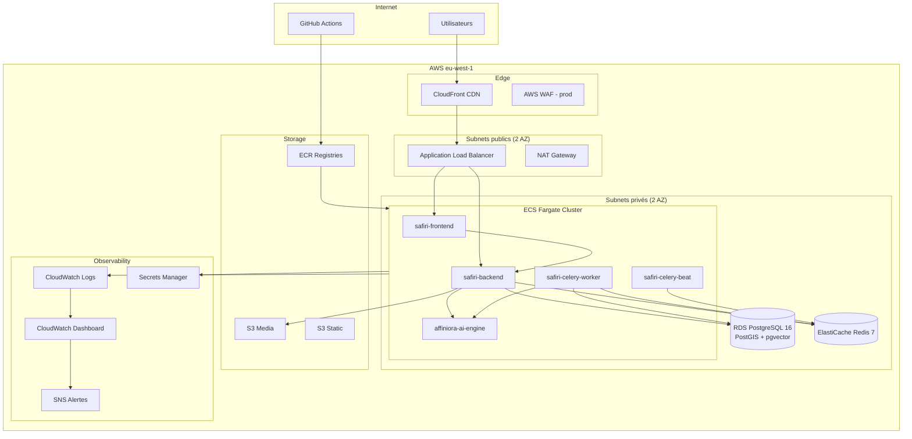

# AFROMIA — Architecture Cloud AWS

## Diagramme complet

## Applications et responsabilités

### SAFIRI — Application principale

| Composant | Rôle | Port | Ressources Fargate |
|-----------|------|------|-------------------|
| `safiri-frontend` | Next.js 15 PWA, UI matchmaking | 3000 | 0.5 vCPU, 1 GB |
| `safiri-backend` | API FastAPI, WebSocket chat, auth | 8000 | 1 vCPU, 2 GB |
| `safiri-celery-worker` | Matching async, emails, scoring | — | 1 vCPU, 2 GB |
| `safiri-celery-beat` | Cron (nettoyage, rappels) | — | 0.25 vCPU, 512 MB |

**Fonctionnalités hébergées :**
- Authentification JWT + OAuth (Google, Microsoft, Facebook, X, TikTok)
- Chat temps réel (WebSocket + Redis Pub/Sub)
- Discover / matching / swipe
- Channels créateur, wallet Safir, paiements Stripe/Campay
- Speed dating (WebSocket + LiveKit — phase 2 cloud)
- Backoffice admin

### AFFINIORA — Moteur IA

| Composant | Rôle | Port | Ressources Fargate |
|-----------|------|------|-------------------|
| `affiniora-ai-engine` | Scoring, personnalité, anti-fake, traduction | 8001 | 2 vCPU, 8 GB |

**Modèles HuggingFace self-hosted** (CPU) :
- Analyse de profil (`POST /v1/analyze/profile-full`)
- Scoring de compatibilité
- Détection anti-fake
- Traduction multilingue (10 locales)

> **Note** : AFFINIORA est isolé du réseau public. Seul `safiri-backend` peut l'appeler via le service discovery ECS.

## Haute disponibilité

| Couche | Stratégie MVP (staging) | Stratégie production |
|--------|------------------------|---------------------|
| Compute (ECS) | 1 tâche/service, 2 AZ | Auto-scaling 2-6, health checks ALB |
| Base de données | RDS single-AZ | RDS Multi-AZ + read replica |
| Cache | ElastiCache 1 nœud | ElastiCache cluster mode |
| CDN | CloudFront global | + WAF, geo-blocking |
| Load balancer | ALB multi-AZ | + sticky sessions WebSocket |

## Scalabilité (auto-scaling ECS)

| Service | Métrique | Seuil scale-out | Max tâches |
|---------|----------|-----------------|------------|
| safiri-backend | CPU > 70 % | +1 tâche | 4 |
| safiri-frontend | Requêtes ALB > 1000/min | +1 tâche | 3 |
| affiniora-ai-engine | CPU > 80 % | +1 tâche | 2 |
| safiri-celery-worker | Queue Redis > 100 | +1 tâche | 2 |

## Sécurité

| Mesure | Implémentation |
|--------|---------------|
| Chiffrement transit | HTTPS (CloudFront + ALB TLS 1.2+) |
| Chiffrement repos | RDS encrypted, S3 SSE, Secrets Manager |
| Réseau | AFFINIORA en subnet privé, pas d'IP publique |
| Identité | IAM `afromia-dev-agent` (moindre privilège) |
| Secrets | AWS Secrets Manager (pas de .env en prod) |
| WAF | À activer en production |

## Services non déployés en MVP (phase 2)

| Service local | Alternative AWS | Quand |
|---------------|-----------------|-------|
| MinIO | S3 natif | MVP (déjà dans Terraform) |
| LiveKit | LiveKit Cloud ou ECS dédié | Speed dating prod |
| Coturn (TURN) | AWS Chime SDK ou Coturn ECS | WebRTC prod |

## Coûts et optimisation pay-as-you-go

- **Fargate Spot** : 70 % d'économie sur celery-worker (tâches interruptibles)
- **RDS** : `db.t3.medium` staging, reserved instances en prod
- **CloudFront** : cache des assets statiques Next.js
- **AFFINIORA** : scale-to-zero impossible (cold start modèles ~2 min) — minimum 1 tâche
